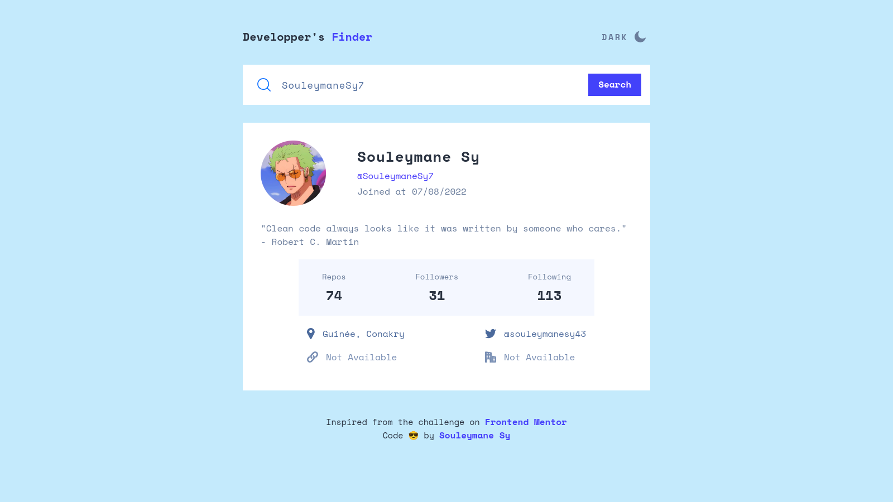

# Github User Search App



## Links

- Live Site Demo URL: [Live Site Demo](https://your-live-site-url.com)

## Welcome! 👋

Thanks for checking out this front-end coding projects.

This projects is for searching Github user based on the username.

Inspired by one of the frontend mentor challenge - [Github User Search App](https://www.frontendmentor.io/challenges/github-user-search-app-Q09YOgaH6)

## Table of contents

- [Screenshots](#screenshots)
- [Built With](#built-with)
- [How To Use This Repos](#how-to-use-this-repos)
- [Author](#author)

## Screenshots

### Mobile


### Mobile Dark


### Tablets


### Desktop


### Desktop Errors


### Lighthouse Stats


## Built with

- Semantic HTML5 markup
- SASS
- CSS custom properties
- Flexbox
- CSS Grid
- Mobile-first workflow
- [Vite Js](https://vitejs.dev/) - Javascript Bundler.
- [PNPM](https://pnpm.io/) - Package Manager.
- [React Js](https://react.dev/) - Javascript Framework.
- [Typescript](https://typescript) - A strongly typed language, builds on top of javascript.

## How To Use This Repos

To clone and run this application, you'll need [Git](https://git-scm.com) and [PNPM](http://pnpm.io/) installed on your computer. From your command line:

```bash
# Clone this repository
$ git clone https://github.com/SouleymaneSy7/github-user-search-app

# Install dependencies
$ pnpm install

# start the server
$ pnpm dev
```

## Author

- GitHub - [Souleymane Sy](https://github.com/SouleymaneSy7)
- Frontend Mentor - [@SouleymaneSy7](https://www.frontendmentor.io/profile/SouleymaneSy7)
- Dev Challenges - [Souleymane Sy](https://devchallenges.io/profile/534cd213-3165-4c16-bdcf-058e1f468da0)
- Twitter - [@Souleymanesy43](https://twitter.com/Souleymanesy43)
